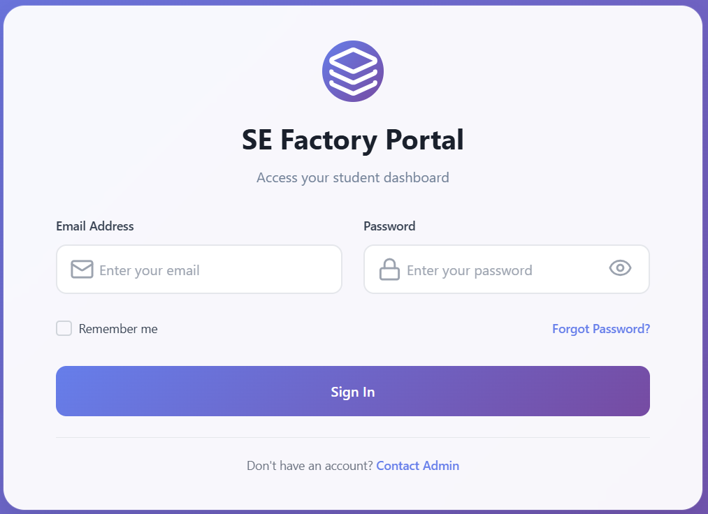
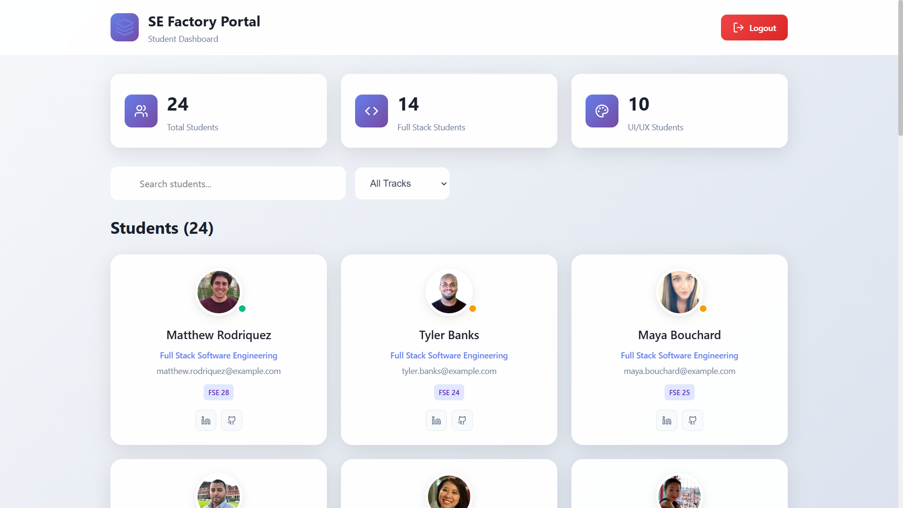
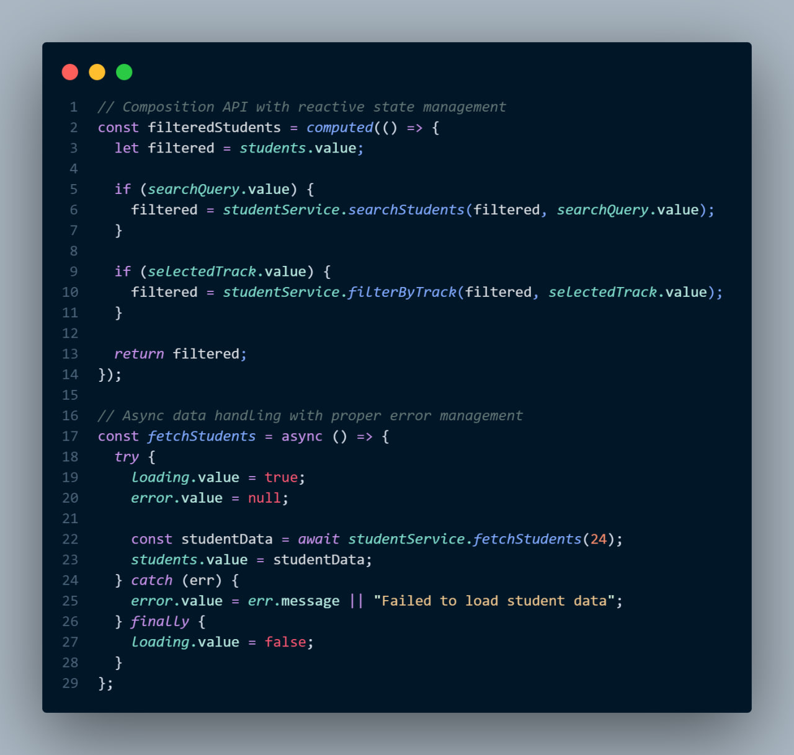
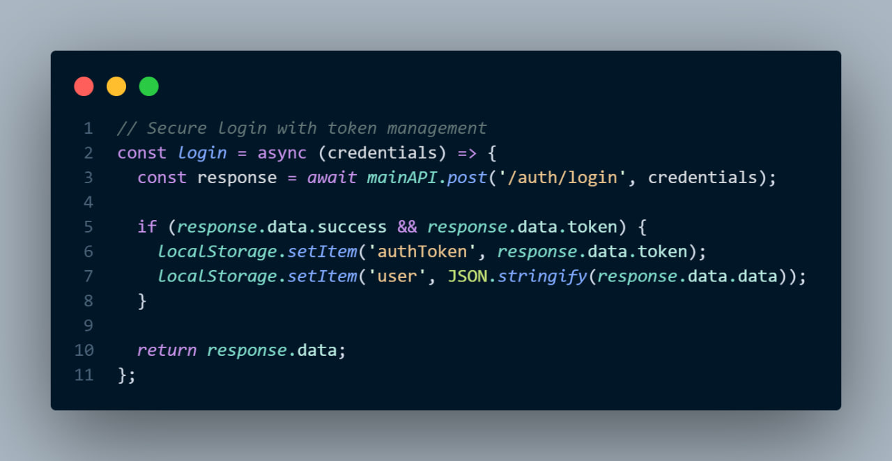
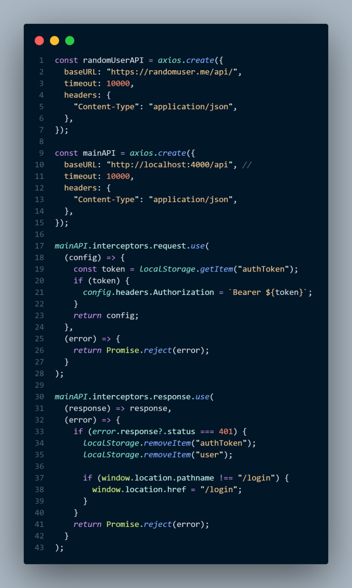
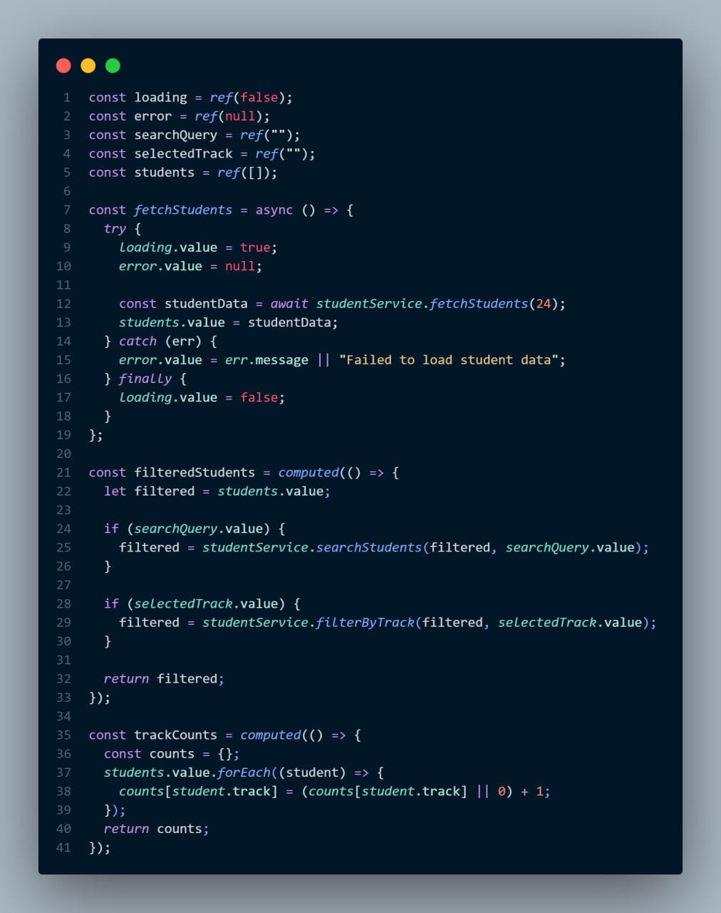
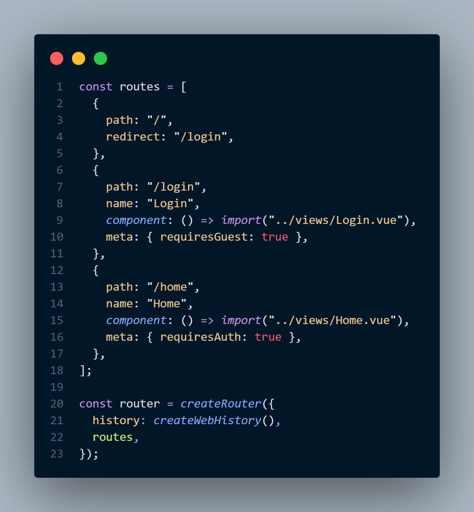

# SE Factory Portal

> A modern student dashboard built with Vue.js 3 and Express.js featuring JWT authentication and real-time data management.

## Features

- **JWT Authentication** - Secure login with Bearer token authorization
- **Dynamic Dashboard** - Real-time student data with search and filtering
- **Modern UI** - Responsive design with Lucide icons and smooth animations
- **Composition API** - Built with Vue 3's latest features for optimal performance
- **Route Guards** - Protected routes with automatic authentication checks

## Tech Stack

**Frontend:**
- Vue.js 3 (Composition API)
- Vue Router 4
- Axios for API calls
- Lucide Vue Icons
- CSS3 with modern animations

**Backend:**
- Express.js
- MySQL with mysql2
- JWT (jsonwebtoken)
- bcryptjs for password hashing
- CORS enabled

## User Interface

<div align="center">
  <table>
    <tr>
      <td><strong>Login Screen</strong></td>
      <td><strong>Dashboard</strong></td>
    </tr>
    <tr>
      <td></td>
      <td></td>
    </tr>
    <tr>
      <td><em>Clean authentication form with validation</em></td>
      <td><em>Interactive student dashboard with real-time search</em></td>
    </tr>
  </table>
</div>

### Dashboard in Action
<div align="center">
  
  <br>
  <em>Real-time search and filtering functionality</em>
</div>

## Code Highlights

### Advanced Vue.js Implementation

<div align="center">
  
</div>

### JWT Authentication System

<div align="center">
  
</div>

## Architecture

### Services Layer
<div align="center">
  
  <br>
  <em>Axios interceptors & API management</em>
</div>

### Vue Components
<div align="center">
  
  <br>
  <em>Component-based architecture</em>
</div>

### Router Setup
<div align="center">
  
  <br>
  <em>Protected routes with auth guards</em>
</div>

## Getting Started

### Prerequisites
- Node.js (v16+)
- MySQL
- npm or yarn

### Installation

1. **Clone the repository**
   ```bash
   git clone <repository-url>
   cd se-factory-portal
   ```

2. **Backend Setup**
   ```bash
   cd backend
   npm install
   
   # Configure environment
   cp .env.example .env
   # Edit .env with your MySQL credentials
   
   # Setup database
   npm run setup-db
   
   # Start server
   npm run dev
   ```

3. **Frontend Setup**
   ```bash
   cd frontend
   npm install
   npm run dev
   ```

4. **Access the application**
   - Frontend: http://localhost:5173
   - Backend: http://localhost:4000

### Default Login
- **Email:** admin@sefactory.com
- **Password:** admin123

## Security Features

- **Password Hashing** - bcrypt with salt rounds
- **JWT Tokens** - Secure authentication with 7-day expiry
- **Route Protection** - Frontend route guards
- **CORS Configuration** - Controlled cross-origin requests
- **Input Validation** - Both frontend and backend validation

## Key Vue.js Features Demonstrated

- **Composition API** for better code organization
- **Reactive State Management** with ref() and computed()
- **Lifecycle Hooks** (onMounted, watch)
- **Custom Composables** for reusable logic
- **Dynamic Components** with conditional rendering
- **Event Handling** with proper error boundaries
- **Route Guards** for authentication flow

## Future Enhancements

- [ ] Real-time notifications
- [ ] Student profile management
- [ ] Advanced filtering options
- [ ] Export functionality
- [ ] Mobile app version

---

<div align="center">
  <strong>Built with ❤️ using Vue.js 3 and Express.js</strong>
</div>